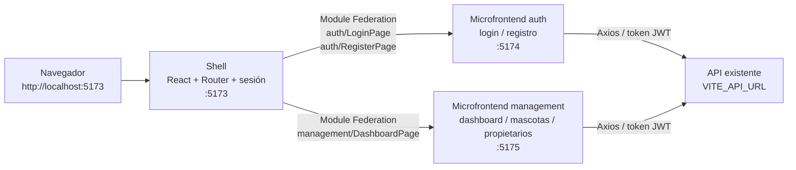
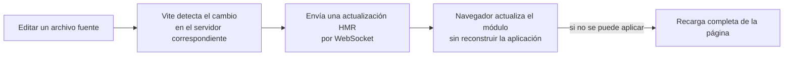

# VeterinarIA — frontend

Frontend de gestión veterinaria hecho con React, TypeScript y Vite. Está organizado como tres aplicaciones frontend: un shell y dos microfrontends cargados en tiempo de ejecución mediante Module Federation.

Para desarrollar localmente usa `npm run dev`; este comando inicia las tres aplicaciones con recarga en caliente (HMR). `npm run build` se conserva para compilar los artefactos de producción: compila los tres microfrontends, pero **no inicia un servidor ni abre la aplicación**. Son tareas distintas.

## Requisitos

- Node.js `20.19+` o `22.12+`.
- npm.
- Docker Desktop solo si se quiere levantar el frontend en contenedores.
- La API disponible para las funciones que hacen peticiones. Este repositorio no cambia ni incluye el backend.

## Inicio de desarrollo

Desde la raíz del frontend:

```bash
npm install
npm run dev
```

Abre <http://localhost:5173>. El comando inicia tres servidores Vite; mantenlo activo mientras trabajas:

| Aplicación | Dirección | Responsabilidad |
| --- | --- | --- |
| Shell | <http://localhost:5173> | Arranque, tema, rutas y sesión |
| Autenticación | <http://localhost:5174> | Login y registro; remoto `auth` |
| Gestión | <http://localhost:5175> | Dashboard, mascotas y propietarios; remoto `management` |

Vite aplica HMR: los cambios de código se reflejan durante el desarrollo sin tener que generar un build de producción ni reiniciar manualmente el frontend. Si se detiene `npm run dev`, también se detienen los tres servidores.

Configura la URL de la API en `.env` si no está disponible en `http://localhost:8080`:

```env
VITE_API_URL=http://localhost:8080
```

Las URLs remotas de desarrollo tienen valores predeterminados en `vite.shell.config.ts`. Se pueden sustituir con `VITE_AUTH_REMOTE_URL` y `VITE_MANAGEMENT_REMOTE_URL` si los remotos se sirven en otros orígenes.

## Arquitectura

### Aplicaciones y dependencias



El **shell** es el punto de entrada del navegador. Mantiene el único `BrowserRouter`, define las rutas de alto nivel, comparte el tema y comprueba la sesión antes de permitir el dashboard. Los módulos remotos se importan de forma diferida; el shell los solicita cuando se visita una ruta que los necesita. `@module-federation/vite` entrega las entradas remotas desde los servidores de desarrollo, sin necesitar un build para arrancar.

Los remotos comparten React, React DOM, React Router, MUI y Emotion como dependencias singleton. Así, los componentes remotos usan la misma instancia del router y pueden usar su contexto de navegación. El estado de autenticación se conserva en `localStorage` mediante el token existente, no mediante un estado duplicado entre aplicaciones.

### Qué pasa al abrir una ruta

```mermaid
sequenceDiagram
    actor Usuario
    participant Navegador
    participant Shell as Shell (:5173)
    participant Remoto as Remoto Vite (auth :5174 / management :5175)
    participant API as API existente

    Usuario->>Navegador: Abre /login o /dashboard
    Navegador->>Shell: Carga la SPA y BrowserRouter
    Shell->>Shell: Comprueba ruta y sesión
    Shell->>Remoto: Solicita el módulo remoto por Module Federation
    Remoto-->>Shell: Entrega el componente y sus dependencias compartidas
    Shell-->>Navegador: Renderiza la vista dentro del router
    Usuario->>Remoto: Inicia sesión o usa gestión
    Remoto->>API: Petición Axios con URL VITE_API_URL
    API-->>Remoto: Respuesta; el token se conserva en localStorage
```

### Recarga en caliente (HMR)



Cada servidor Vite observa los archivos que le pertenecen: el shell en `5173`, autenticación en `5174` y gestión en `5175`. Por eso `npm run dev` inicia los tres. Una actualización en un remoto se sirve desde su propio servidor y el shell sigue cargándolo por Module Federation.

## Aplicaciones y cambios realizados

### `shell` — aplicación contenedora

**Para qué sirve:** orquesta las vistas y proporciona los servicios transversales: arranque de React, tema, navegación y control de acceso.

**Cambios:** `src/App.tsx` ya no contiene directamente los formularios ni el dashboard; carga `auth/LoginPage`, `auth/RegisterPage` y `management/DashboardPage` de forma diferida con `React.lazy` y muestra un indicador mientras cada remoto carga. Conserva las rutas `/login`, `/register`, `/admin/register` y `/dashboard`, además de las comprobaciones de sesión y rol administrador. `src/main.tsx` sigue montando `BrowserRouter`, `ThemeProvider` y `CssBaseline` una sola vez.

**Configuración:** `vite.shell.config.ts` registra al shell como host de Module Federation y define las direcciones de los remotos. `vite.config.ts` mantiene el acceso Vite habitual apuntando a esta configuración.

### `auth` — microfrontend de autenticación

**Para qué sirve:** agrupa las pantallas de login y registro, incluyendo el registro especial de administradores.

**Cambios:** `src/auth/remote/LoginPage.tsx` y `RegisterPage.tsx` adaptan los formularios existentes a las rutas y navegación del shell. `LoginForm.tsx`, `RegisterForm.tsx`, `authService.ts` y la validación siguen realizando el trabajo existente; no se cambió el contrato de la API. `vite.auth.config.ts` expone los componentes `./LoginPage` y `./RegisterPage` y configura el servidor de desarrollo en `5174`.

### `management` — microfrontend de gestión

**Para qué sirve:** presenta el dashboard autenticado y las pantallas de dashboard, mascotas y propietarios dentro del layout de gestión.

**Cambios:** `src/dashboard/remote/DashboardPage.tsx` contiene la composición que antes estaba dentro de `src/App.tsx`: layout, navegación entre pantallas, acciones y mensajes de éxito. Reutiliza los componentes de dashboard, propietarios, mascotas y el servicio de autenticación existentes. `vite.management.config.ts` expone `./DashboardPage` y configura el servidor de desarrollo en `5175`.

### Tipos, tema y estilos compartidos

- `src/remotes.d.ts` declara los tipos TypeScript de los imports remotos para el shell.
- `src/index.css` conserva Tailwind, variables de estilo y estilos globales. Se importa también desde las entradas remotas para que los estilos estén presentes tanto en desarrollo como al publicarlas por separado.
- `src/theme.ts` es el tema MUI usado por `ThemeProvider`.
- `tsconfig.app.json` y `tsconfig.node.json` incluyen los nuevos archivos de configuración y tipos.
- `package.json` incorpora scripts independientes para shell y remotos. `npm run dev` levanta los tres procesos a la vez.

## ¿Se usa MUI?

**Sí, pero actualmente de forma limitada.** MUI está instalado; `src/main.tsx` usa `ThemeProvider` y `CssBaseline`, y `src/theme.ts` define la paleta y estilos base del tema. La mayoría de las vistas y formularios actuales están construidos con clases Tailwind, HTML y estilos propios; no se observa un uso extendido de componentes visuales MUI como `Button`, `TextField` o `Dialog`. `@mui/icons-material` también está en las dependencias, pero el frontend usa además iconos SVG propios en `src/shared/icons.tsx`.

## Docker (solo frontend)

Docker es opcional para el desarrollo HMR. El Compose incluido construye y sirve el shell y los dos remotos como contenedores Nginx; no contiene la API ni la base de datos.

```bash
docker compose -f docker-compose.frontend.yml up --build
```

El shell queda en <http://localhost:3000>. Los remotos se exponen por separado en los puertos `3001` y `3002`; el shell los carga mediante rutas proxy del mismo origen. `VITE_API_URL` debe ser una URL accesible **desde el navegador**. Si se publica el shell en otro dominio, configura `FRONTEND_PUBLIC_URL` o las URLs `VITE_AUTH_REMOTE_URL` y `VITE_MANAGEMENT_REMOTE_URL` al construir las imágenes.

`Dockerfile.frontend` crea una imagen para cada aplicación según `APP_TARGET` (`shell`, `auth` o `management`). `nginx/shell.conf` sirve el shell y envía las rutas de remotos a sus servicios; `nginx/remote.conf` sirve los archivos estáticos de cada remoto. `docker-compose.frontend.yml` conecta los tres servicios. En los contenedores no se usa HMR: se sirven los artefactos estáticos generados para producción.

Los comandos `npm run build`, `npm run build:shell`, `npm run build:auth` y `npm run build:management` son **solo para compilación/producción**. No son pasos necesarios para el flujo de desarrollo con `npm run dev`.

| Comando | Qué hace |
| --- | --- |
| `npm run dev` | Inicia shell, auth y management con Vite HMR |
| `npm run build` | Compila TypeScript y genera las tres salidas de producción en `dist/` |
| `npm run build:shell` | Compila solo el shell |
| `npm run build:auth` | Compila solo el remoto de autenticación |
| `npm run build:management` | Compila solo el remoto de gestión |
| `npm run lint` | Ejecuta Oxlint |

Si el navegador muestra un error, comprueba primero que `npm run dev` siga ejecutándose y revisa la consola del navegador y la terminal de Vite. Ejecutar `npm run build` no es el comando para iniciar la aplicación ni sustituye a los servidores de desarrollo de los remotos.

## Estructura relevante

```text
src/
├── api/                      # Axios y servicios de comunicación con la API
├── auth/
│   ├── components/           # Formularios existentes de login y registro
│   └── remote/               # Entradas expuestas del microfrontend auth
├── dashboard/
│   ├── components/           # Contenido de dashboard
│   ├── layout/               # Layout de gestión
│   ├── mascotas/             # Pantallas y formularios de mascotas
│   ├── propietarios/         # Pantallas y formularios de propietarios
│   └── remote/               # Entrada expuesta del microfrontend management
├── shared/                   # Iconos y componentes compartidos
├── App.tsx                   # Rutas y composición del shell
├── main.tsx                  # Arranque, tema y router
├── remotes.d.ts              # Tipos de los imports Module Federation
└── index.css                 # Tailwind y estilos globales

vite.shell.config.ts          # Host / shell
vite.auth.config.ts           # Remote auth
vite.management.config.ts     # Remote management
Dockerfile.frontend           # Imagen parametrizada del frontend
docker-compose.frontend.yml   # Shell + remotos; no incluye backend
nginx/                        # Servir estáticos y proxy a los remotos
```
