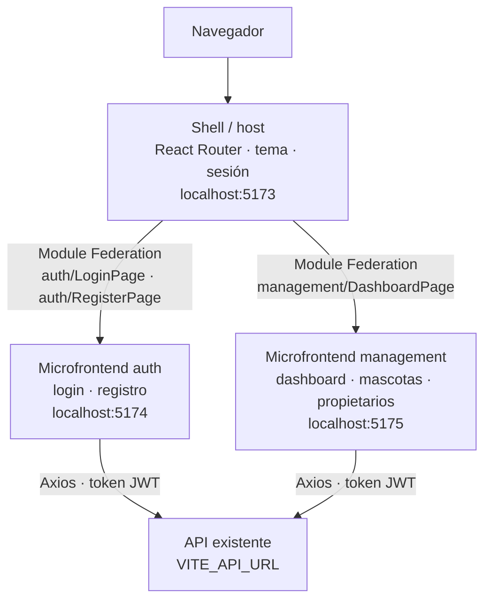
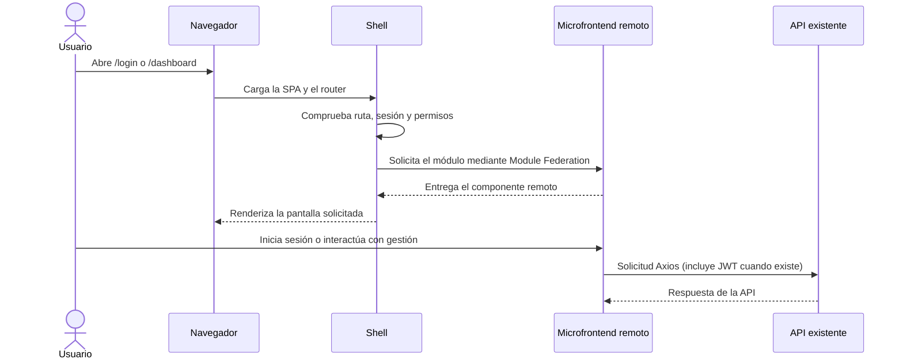
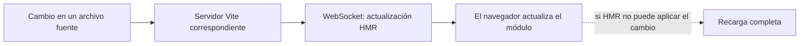

<div align="center">

# VeterinarIA — Frontend

**Gestión veterinaria moderna, modular y rápida.**
Tres aplicaciones frontend unidas en tiempo de ejecución con Module Federation.


[Inicio rápido](#inicio-rápido) · [Arquitectura](#arquitectura) · [Aplicaciones](#aplicaciones) · [Docker](#docker-solo-frontend) · [Comandos](#comandos-disponibles)

</div>

---

## Descripción

VeterinarIA es el frontend de gestión veterinaria, construido con **React, TypeScript y Vite**. Está organizado como tres aplicaciones:

- **Shell**: la aplicación contenedora (rutas, tema y sesión).
- **auth**: microfrontend de login y registro.
- **management**: microfrontend de dashboard, mascotas y propietarios.

Los microfrontends se cargan en tiempo de ejecución mediante **Module Federation**.

> [!IMPORTANT]
> Para desarrollar usa `npm run dev`: inicia las tres aplicaciones con recarga en caliente (HMR).
> `npm run build` es **solo para producción**: compila los artefactos, pero **no inicia un servidor ni abre la aplicación**. Son tareas distintas.

## Tabla de contenido

- [Requisitos](#requisitos)
- [Inicio rápido](#inicio-rápido)
- [Configuración](#configuración)
- [Arquitectura](#arquitectura)
- [Aplicaciones](#aplicaciones)
- [Tipos, tema y estilos compartidos](#tipos-tema-y-estilos-compartidos)
- [¿Se usa MUI?](#se-usa-mui)
- [Docker (solo frontend)](#docker-solo-frontend)
- [Comandos disponibles](#comandos-disponibles)
- [Estructura del proyecto](#estructura-del-proyecto)

---

## Requisitos

| Herramienta | Versión / nota |
| --- | --- |
| **Node.js** | `20.19+` o `22.12+` |
| **npm** | Incluido con Node.js |
| **Docker Desktop** | Opcional, solo para levantar el frontend en contenedores |
| **API** | Debe estar disponible para las funciones que hacen peticiones |

> [!NOTE]
> Este repositorio no incluye ni modifica el backend.

## Inicio rápido

Desde la raíz del frontend:

```bash
npm install
npm run dev
```

Luego abre **<http://localhost:5173>**.

El comando inicia **tres servidores Vite**; mantenlo activo mientras trabajas:

| Aplicación | Dirección | Responsabilidad |
| --- | --- | --- |
| Shell | <http://localhost:5173> | Arranque, tema, rutas y sesión |
| Autenticación | <http://localhost:5174> | Login y registro; remoto `auth` |
| Gestión | <http://localhost:5175> | Dashboard, mascotas y propietarios; remoto `management` |

Vite aplica **HMR**: los cambios de código se reflejan al instante, sin generar un build de producción ni reiniciar el frontend. Si detienes `npm run dev`, también se detienen los tres servidores.

## Configuración

Si la API no está en `http://localhost:8080`, define su URL en un archivo `.env`:

```env
VITE_API_URL=http://localhost:8080
```

<details>
<summary><b>Variables opcionales para los remotos</b></summary>

<br>

Las URLs remotas de desarrollo tienen valores predeterminados en `vite.shell.config.ts`. Puedes sustituirlas si los remotos se sirven en otros orígenes:

```env
VITE_AUTH_REMOTE_URL=http://localhost:5174/remoteEntry.js
VITE_MANAGEMENT_REMOTE_URL=http://localhost:5175/remoteEntry.js
```

</details>

---

## Arquitectura

### Aplicaciones y dependencias



El **shell** es el punto de entrada del navegador. Mantiene el único `BrowserRouter`, define las rutas de alto nivel, comparte el tema y comprueba la sesión antes de permitir el dashboard. Los módulos remotos se importan de forma diferida: el shell los solicita cuando se visita una ruta que los necesita. `@module-federation/vite` entrega las entradas remotas desde los servidores de desarrollo, sin necesidad de un build para arrancar.

Los remotos comparten **React, React DOM, React Router, MUI y Emotion** como dependencias *singleton*. Así, usan la misma instancia del router y su contexto de navegación. El estado de autenticación se conserva en `localStorage` mediante el token existente, sin duplicar estado entre aplicaciones.

### Qué pasa al abrir una ruta



### Recarga en caliente (HMR)



Cada servidor Vite observa los archivos que le pertenecen: shell en `5173`, autenticación en `5174` y gestión en `5175`. Por eso `npm run dev` inicia los tres. Una actualización en un remoto se sirve desde su propio servidor y el shell sigue cargándolo por Module Federation.

---

## Aplicaciones

### `shell` — aplicación contenedora

> Orquesta las vistas y ofrece los servicios transversales: arranque de React, tema, navegación y control de acceso.

**Cambios realizados**

- `src/App.tsx` ya no contiene los formularios ni el dashboard: carga `auth/LoginPage`, `auth/RegisterPage` y `management/DashboardPage` con `React.lazy` y muestra un indicador mientras cada remoto carga.
- Conserva las rutas `/login`, `/register`, `/admin/register` y `/dashboard`, además de las comprobaciones de sesión y de rol administrador.
- `src/main.tsx` sigue montando `BrowserRouter`, `ThemeProvider` y `CssBaseline` una sola vez.

**Configuración**

- `vite.shell.config.ts` registra al shell como *host* de Module Federation y define las direcciones de los remotos.
- `vite.config.ts` mantiene el acceso Vite habitual apuntando a esa configuración.

### `auth` — microfrontend de autenticación

> Agrupa las pantallas de login y registro, incluyendo el registro especial de administradores.

**Cambios realizados**

- `src/auth/remote/LoginPage.tsx` y `RegisterPage.tsx` adaptan los formularios existentes a las rutas y la navegación del shell.
- `LoginForm.tsx`, `RegisterForm.tsx`, `authService.ts` y la validación siguen haciendo el trabajo de siempre; **el contrato de la API no cambió**.
- `vite.auth.config.ts` expone `./LoginPage` y `./RegisterPage` y configura el servidor de desarrollo en `5174`.

### `management` — microfrontend de gestión

> Presenta el dashboard autenticado y las pantallas de dashboard, mascotas y propietarios dentro del layout de gestión.

**Cambios realizados**

- `src/dashboard/remote/DashboardPage.tsx` contiene la composición que antes estaba en `src/App.tsx`: layout, navegación entre pantallas, acciones y mensajes de éxito.
- Reutiliza los componentes de dashboard, propietarios, mascotas y el servicio de autenticación existentes.
- `vite.management.config.ts` expone `./DashboardPage` y configura el servidor de desarrollo en `5175`.

---

## Tipos, tema y estilos compartidos

| Archivo | Función |
| --- | --- |
| `src/remotes.d.ts` | Tipos TypeScript de los imports remotos para el shell |
| `src/index.css` | Tailwind, variables de estilo y estilos globales; también se importa desde las entradas remotas, así los estilos están presentes en desarrollo y al publicarlas por separado |
| `src/theme.ts` | Tema MUI usado por `ThemeProvider` |
| `tsconfig.app.json` / `tsconfig.node.json` | Incluyen los nuevos archivos de configuración y tipos |
| `package.json` | Scripts independientes para shell y remotos; `npm run dev` levanta los tres a la vez |

## ¿Se usa MUI?

- MUI está instalado; `src/main.tsx` usa `ThemeProvider` y `CssBaseline`, y `src/theme.ts` define la paleta y los estilos base.
- La mayoría de las vistas y formularios se construyen con **clases Tailwind**, HTML y estilos propios, sin uso extendido de componentes como `Button`, `TextField` o `Dialog`.
- `@mui/icons-material` está en las dependencias, pero el frontend usa además iconos SVG propios en `src/shared/icons.tsx`.

---

## Docker (solo frontend)

> [!TIP]
> Docker es opcional para el desarrollo con HMR. Úsalo para probar los artefactos de producción.

El Compose incluido construye y sirve el shell y los dos remotos como contenedores **Nginx**. No contiene la API ni la base de datos.

```bash
docker compose -f docker-compose.frontend.yml up --build
```

| Servicio | Puerto |
| --- | --- |
| Shell | <http://localhost:3000> |
| Remoto auth | <http://localhost:3001/auth-remote/remoteEntry.js> |
| Remoto management | <http://localhost:3002/management-remote/remoteEntry.js> |

El shell carga los remotos mediante rutas proxy del mismo origen.

Para detener y retirar los contenedores:

```bash
docker compose -f docker-compose.frontend.yml down
```

> [!WARNING]
> `VITE_API_URL` debe ser una URL accesible **desde el navegador**. Si publicas el shell en otro dominio, configura `FRONTEND_PUBLIC_URL` o las URLs `VITE_AUTH_REMOTE_URL` y `VITE_MANAGEMENT_REMOTE_URL` al construir las imágenes.

<details>
<summary><b>Archivos de Docker y Nginx</b></summary>

<br>

- `Dockerfile.frontend`: crea una imagen por aplicación según `APP_TARGET` (`shell`, `auth` o `management`).
- `nginx/shell.conf`: sirve el shell y envía las rutas de remotos a sus servicios.
- `nginx/remote.conf`: sirve los archivos estáticos de cada remoto.
- `docker-compose.frontend.yml`: conecta los tres servicios.

En los contenedores **no se usa HMR**: se sirven los artefactos estáticos generados para producción.

</details>

---

## Comandos disponibles

| Comando | Qué hace | Uso |
| --- | --- | --- |
| `npm run dev` | Inicia shell, auth y management con Vite HMR | Desarrollo |
| `npm run build` | Compila TypeScript y genera las tres salidas de producción en `dist/` | Producción |
| `npm run build:shell` | Compila solo el shell | Producción |
| `npm run build:auth` | Compila solo el remoto de autenticación | Producción |
| `npm run build:management` | Compila solo el remoto de gestión | Producción |
| `npm run lint` | Ejecuta Oxlint | Calidad |

> [!CAUTION]
> Los comandos `build` **no son pasos del flujo de desarrollo** ni sustituyen a los servidores de `npm run dev`.

### Solución de problemas

Si el navegador muestra un error:

1. Comprueba que `npm run dev` siga ejecutándose.
2. Revisa la consola del navegador.
3. Revisa la terminal de Vite.

---

## Estructura del proyecto

```text
src/
├── api/                      # Axios y servicios de comunicación con la API
├── auth/
│   ├── components/           # Formularios existentes de login y registro
│   └── remote/               # Entradas expuestas del microfrontend auth
├── dashboard/
│   ├── components/           # Contenido de dashboard
│   ├── layout/               # Layout de gestión
│   ├── mascotas/             # Pantallas y formularios de mascotas
│   ├── propietarios/         # Pantallas y formularios de propietarios
│   └── remote/               # Entrada expuesta del microfrontend management
├── shared/                   # Iconos y componentes compartidos
├── App.tsx                   # Rutas y composición del shell
├── main.tsx                  # Arranque, tema y router
├── remotes.d.ts              # Tipos de los imports Module Federation
└── index.css                 # Tailwind y estilos globales

vite.shell.config.ts          # Host / shell
vite.auth.config.ts           # Remote auth
vite.management.config.ts     # Remote management
Dockerfile.frontend           # Imagen parametrizada del frontend
docker-compose.frontend.yml   # Shell + remotos; no incluye backend
nginx/                        # Servir estáticos y proxy a los remotos
```